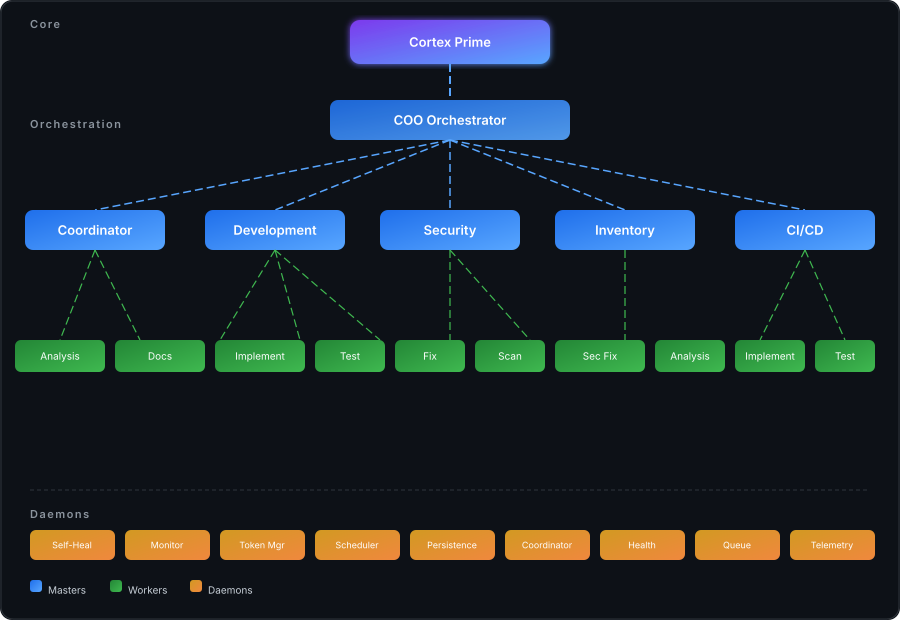

<div align="center">

# Cortex

**Multi-agent AI system for autonomous repository and infrastructure management.**

> ⚠️ **This project is archived.** Cortex is no longer under active development. Explore the code, but no new features or fixes are planned.

</div>

---

## What It Does

Cortex automates DevOps workflows through a master-worker agent architecture. Five master agents coordinate specialized workers across implementation, testing, security scanning, documentation, and analysis.

## Architecture

<div align="center"></div>

### Agents

| Master | Responsibility | Workers |
|--------|---------------|---------|
| Coordinator | Task routing, prioritization | Analysis, Documentation |
| Development | Code changes, PRs | Implementation, Test, Fix |
| Security | Vulnerability management | Scan, Security Fix |
| Inventory | Asset tracking | Analysis |
| CI/CD | Pipeline management | Implementation, Test |

### Daemons

9 background processes handle self-healing, monitoring, token budget enforcement, and coordination persistence.

### Observability Pipeline

```
Sources → Processors → Destinations → API → Dashboard
```

- 4 processors: enrich, filter, sample, redact PII
- 5 destinations: PostgreSQL, S3, webhook, JSONL, console
- 15+ REST endpoints, full-text search, cost tracking

## Key Numbers

- **94%** worker success rate
- **200k** daily token budget
- **94** passing tests (observability pipeline)
- **5** master agents, **7** worker types, **9** daemons

## Tech Stack

`TypeScript` · `Python` · `K3s` · `ArgoCD` · `Redis` · `PostgreSQL` · `Claude API` · `MCP` · `PyTorch` · `Elastic APM`

---

<div align="center">
<sub>Built with Claude. No longer maintained.</sub>
</div>
