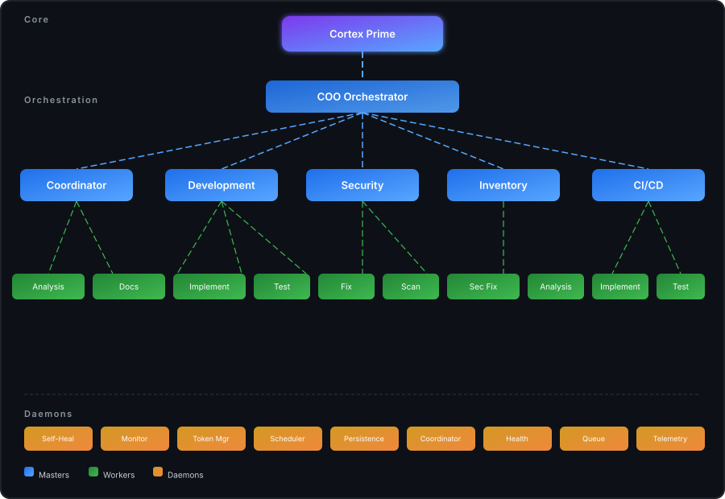

> [!NOTE]
> **Archived.** This repo is part of [Cortex](https://github.com/cortex-io), which is no longer under active development. It is kept as a working record: explore, fork and borrow freely, but no fixes or features are planned.

<p align="center"><sub><a href="https://github.com/cortex-io"><b>Cortex</b></a> &nbsp;·&nbsp; <b>cortex</b> · <a href="https://github.com/cortex-io/cortex-platform">cortex-platform</a> · <a href="https://github.com/cortex-io/cortex-gitops">cortex-gitops</a> · <a href="https://github.com/cortex-io/cortex-k3s">cortex-k3s</a> · <a href="https://github.com/cortex-io/cortex-docs">cortex-docs</a> · <a href="https://github.com/cortex-io/cortex-construction-hq">cortex-construction-hq</a> · <a href="https://github.com/cortex-io/infrastructure-docs">infrastructure-docs</a></sub></p>

## What it does

Cortex automated DevOps through a master-worker agent architecture. **Cortex Prime** set direction, a **COO orchestrator** routed work, and five master agents each led specialized workers across implementation, testing, security scanning, documentation and analysis.



### The agents

| Master | Responsibility | Workers |
|---|---|---|
| Coordinator | Task routing and prioritization | Analysis, Documentation |
| Development | Code changes and PRs | Implementation, Test, Fix |
| Security | Vulnerability management | Scan, Security Fix |
| Inventory | Asset tracking | Analysis |
| CI/CD | Pipeline management | Implementation, Test |

### The daemons

Nine background processes handled self-healing, monitoring, token-budget enforcement and coordination persistence.

### The observability pipeline

```
Sources → Processors → Destinations → API → Dashboard
```

- **4 processors:** enrich, filter, sample, redact PII
- **5 destinations:** PostgreSQL, S3, webhook, JSONL, console
- **15+ REST endpoints** with full-text search and cost tracking

## By the numbers

| 94% | 200k | 94 | 5 · 7 · 9 |
|:--:|:--:|:--:|:--:|
| worker success rate | daily token budget | passing pipeline tests | masters · worker types · daemons |

## Stack

`TypeScript` · `Python` · `K3s` · `ArgoCD` · `Redis` · `PostgreSQL` · `Claude API` · `MCP` · `PyTorch` · `Elastic APM`

---

<p align="center"><sub>Part of the <a href="https://github.com/cortex-io">Cortex archive</a> · built with Claude</sub></p>
