# Teaching Cortex to Ask "How Did I Do?"

**December 12, 2025** | Ryan Dahlberg



---

## TL;DR

Cortex just learned to ask for feedback. After analyzing what makes a true AI agent tick, we discovered Cortex was missing something fundamental: **the ability to learn from you**. In one intense development session, we added three critical systems that transformed Cortex from a task orchestrator into a self-improving AI agent.

**What changed:**
- 🎯 **RLHF Feedback System** - Cortex now asks "How did I do?" after completing tasks
- 🤔 **Self-Evaluation Gates** - Checks "Am I confident enough?" before taking action
- 🔍 **Proactive Scanning** - Actively looks for problems instead of waiting for tasks
- 📈 **Overall Impact** - Jumped from 71% to 91% AI agent alignment

**The Result:** Cortex can now learn from your feedback, question its own decisions, and proactively find issues—just like the AI agents you see in videos and demos.

---

## The "Aha" Moment

You know those AI agent demos where the system books a flight, then politely asks "Did this meet your needs?" and you give it a thumbs up or thumbs down? That simple interaction is what makes the difference between a tool and an intelligent assistant.

We realized Cortex was missing that conversation.

It could route tasks, spawn workers, and orchestrate complex operations. But it never asked **"Was this the right decision?"** It never wondered **"Should I double-check before proceeding?"** And it certainly didn't go looking for problems on its own.

So we set out to change that.

## What We Built

### 1. The Feedback Collector: "How Did I Do?"

Imagine you ask Cortex to scan a repository for security issues. It routes the task to the security expert, runs the scan, and reports back with findings. In the old world, that's where the story ended.

Now? Cortex asks:
- **Was that the right expert for this task?** (thumbs up, neutral, thumbs down)
- **Did the result meet your expectations?** (excellent, good, acceptable, poor)
- **Would you route this the same way next time?**

Your answers go straight into the learning system. If you say "wrong expert," Cortex adjusts its routing weights. If you say "excellent outcome," it boosts confidence in that decision pattern. Over time, it gets **personalized to how you work**.

### 2. Self-Evaluation Gates: "Am I Sure About This?"

Before the update, Cortex would make a routing decision with 55% confidence and just... go for it. No second-guessing. No safety checks.

Now, before taking any significant action, Cortex evaluates itself:

```
Confidence: 55%
Priority: High
Decision: ⚠️ ESCALATE - "Too uncertain for high-priority task"
```

```
Confidence: 85%
Priority: Medium
Decision: ✅ PROCEED - "High confidence, safe to continue"
```

It's like having an internal quality control system that says "Wait, am I sure about this?" before hitting the button. High-confidence decisions proceed automatically. Low-confidence decisions get escalated to you for review.

### 3. Proactive Scanner: The Night Watch

This one's simple but powerful. Instead of waiting for you to ask "Hey, can you check if there are any security vulnerabilities?", Cortex now does it automatically:

- **Every night at 2 AM**: Security scans across all repositories
- **Every night at 3 AM**: Dependency health checks
- **Every hour**: System health monitoring

It's like having a security guard who does rounds on a schedule, looking for problems before they become emergencies.

## The Technical Journey (Made Simple)

We analyzed Cortex against what researchers call the "AI Agent Anatomy":

**What an AI Agent Needs:**
1. **Sensing** - Get information from the world
2. **Thinking** - Process it with context and reasoning
3. **Acting** - Do something with the results
4. **Feedback Loop** - Learn and improve

Cortex was great at #1-3 but terrible at #4. The feedback loop was barely there.

So we built:
- A **feedback collector** that requests human input
- A **self-evaluation system** that checks decisions before executing
- A **proactive scanner** that seeks out issues automatically
- Integration with the existing **meta-learning system**

## The Results

Here's what changed in numbers:

| Component | Before | After | Improvement |
|-----------|--------|-------|-------------|
| Feedback Loop | 45% | 95% | +50% ⭐ |
| Sensing | 65% | 85% | +20% |
| Thinking | 85% | 90% | +5% |
| Acting | 90% | 95% | +5% |
| **Overall** | **71%** | **91%** | **+20%** |

But numbers don't tell the whole story. Here's what it **feels** like:

**Before:** Cortex was like a very capable intern. It could execute tasks well when you told it exactly what to do, but it never learned from mistakes or asked clarifying questions.

**After:** Cortex is like a senior engineer. It questions its own decisions, learns from feedback, actively looks for problems, and gets better at understanding what you actually want over time.

## Real-World Example

Let's walk through what happens now when you assign a task:

**You:** "Scan the authentication module for security issues"

**Cortex (Internal):**
```
Analyzing task...
Expert recommendation: security-master (confidence: 0.65)
⚠️ Confidence below threshold for high-priority security task
Decision: Request more information

Question to user: "This could be a security scan OR a code review.
Which expert should handle this?"
```

**You:** "Security scan"

**Cortex:**
```
Updated confidence: 0.85
✅ Proceeding with security-master
Spawning scan worker...
[Executes scan]
Results: 3 medium vulnerabilities found

Requesting feedback:
- Was security-master the right choice?
- Did the scan meet your expectations?
```

**You:** ✅ "Correct expert, good results"

**Cortex:**
```
Learning recorded:
- Boost: "authentication" + "security issues" → security-master
- Quality score: 0.85
- Pattern saved for future similar tasks
```

The next time you ask about authentication security, Cortex will route it correctly with 95%+ confidence.

## What This Means for You

If you're using Cortex (or thinking about it), here's what just got better:

1. **Fewer Wrong Decisions** - Self-evaluation catches low-confidence routing before it causes problems
2. **Personalized Intelligence** - Your feedback trains Cortex to work the way you think
3. **Proactive Problem Detection** - Security issues and outdated dependencies get flagged automatically
4. **Visible Learning** - You can see Cortex getting smarter over time

## The Philosophy: AI That Learns WITH You

This update embodies a core belief: **The best AI systems don't just work FOR you, they learn WITH you.**

Every thumbs up or thumbs down is a teaching moment. Every escalated decision is a chance to calibrate. Every proactive scan is a chance to catch problems early.

Cortex isn't trying to be perfect out of the box. It's trying to become the perfect **companion for your workflow**.

## Try It Yourself

The new systems are live in the `docker-container` branch:

```bash
# Request feedback on a completed task
./lib/feedback/rlhf-collector.sh list

# Provide feedback
./lib/feedback/rlhf-collector.sh respond <id> 2 3 5 "Yes, same expert" "Great!"

# Check self-evaluation history
./lib/coordination/self-evaluation.sh summary

# View proactive scan results
./scripts/daemons/proactive-scanner-daemon.sh status
```

## What's Next

We activated 16 self-optimization tasks that will continue improving Cortex:
- **Timeout Learning** - Learn optimal task timeouts from history
- **Granularity Optimizer** - Adapt task decomposition based on complexity
- **Result Analyzer** - Detect and prevent redundant work
- **Meta-Learner** - System-wide daily optimization

Think of it as Cortex building Cortex. The system is now working on making itself smarter while you sleep.

## The Bottom Line

Teaching Cortex to ask "How did I do?" might seem like a small thing, but it fundamentally changes the relationship between human and AI.

It's no longer just: You ask → Cortex does → Done.

Now it's: You ask → Cortex evaluates → Cortex acts → Cortex learns → Next time is better.

And that's what makes it feel less like a tool and more like a teammate.

---

**Technical Details:** The complete evolution documentation is in [CORTEX-EVOLUTION-COMPLETE.md](https://github.com/ry-ops/cortex/blob/docker-container/CORTEX-EVOLUTION-COMPLETE.md)

**Contribute:** Found a bug? Have feedback? [Open an issue](https://github.com/ry-ops/cortex/issues) or [start a discussion](https://github.com/ry-ops/cortex/discussions)

**Try Cortex:** [Installation Guide](https://github.com/ry-ops/cortex#installation)

---

*Special thanks to the Claude Code team for building the platform that made this level of meta-development possible.*
